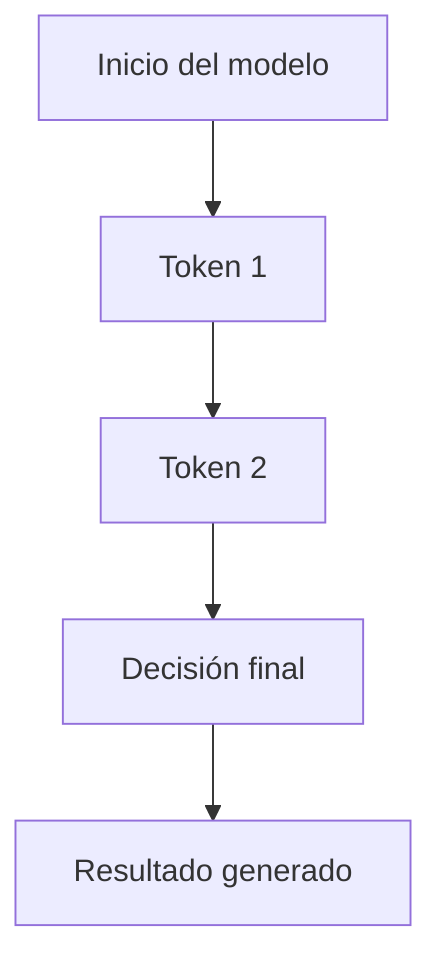

# 🧠 Actividad S01: Exploración de elementos dinámicos

Esta actividad te permitirá interactuar con contenido enriquecido como **diagramas**, **fórmulas matemáticas**, **código**, y **bloques visuales temáticos**.

---

## 🔷 Definición clave

<div class="bloque definicion">
La inteligencia artificial (IA) es la capacidad de una máquina para imitar funciones cognitivas humanas como el aprendizaje, la percepción y la toma de decisiones.
</div>

---

## 🧮 Ejemplo con MathJax

La ecuación de probabilidad condicional en modelos de lenguaje es:

$$ P(w_t \mid w_1, w_2, \ldots, w_{t-1}) $$

Donde \(w_t\) es el token actual, y \(w_{t-1}\) los anteriores en la secuencia.

---

## 🐍 Bloque de código en Python

```python
import random

def generar_token(contexto):
    vocabulario = ["IA", "ética", "modelo", "alineación"]
    return random.choice(vocabulario)

print(generar_token("La IA puede"))
```


¡Claro, arnulfo! Aquí tienes un archivo llamado `actividad_s01.md` que aprovecha **todo el poder de tu sitio educativo configurado con Jekyll, Markdown, Mermaid, MathJax y Highlight.js**. Puedes copiar y pegar directamente este contenido en GitHub creando el archivo en `actividades/actividad_s01.md`.

---

### 📄 `actividades/actividad_s01.md`

```markdown
---
layout: default
title: Actividad S01 – Introducción a IA Interactiva
---

# 🧠 Actividad S01: Exploración de elementos dinámicos

Esta actividad te permitirá interactuar con contenido enriquecido como **diagramas**, **fórmulas matemáticas**, **código**, y **bloques visuales temáticos**.

---

## 🔷 Definición clave

<div class="bloque definicion">
La inteligencia artificial (IA) es la capacidad de una máquina para imitar funciones cognitivas humanas como el aprendizaje, la percepción y la toma de decisiones.
</div>

---

## 🧮 Ejemplo con MathJax

La ecuación de probabilidad condicional en modelos de lenguaje es:

$$ P(w_t \mid w_1, w_2, \ldots, w_{t-1}) $$

Donde \(w_t\) es el token actual, y \(w_{t-1}\) los anteriores en la secuencia.

---

## 🐍 Bloque de código en Python

```python
import random

def generar_token(contexto):
    vocabulario = ["IA", "ética", "modelo", "alineación"]
    return random.choice(vocabulario)

print(generar_token("La IA puede"))
```

---

## 📊 Diagrama Mermaid


---

## ⚠️ Advertencia

<div class="bloque advertencia">
⚠️ Recuerda que los modelos pueden generar contenido aparentemente válido pero sin fundamento real. Verifica la información en fuentes confiables.
</div>

---

## 💡 Ejemplo de bloque temático visual

<div class="bloque ejemplo">
💡 Ejemplo: Si el prompt es ambiguo como "¿Qué novelas escribió Aristóteles?", el modelo puede "alucinar" datos inventados que suenen coherentes pero no sean reales.
</div>

---

## 📌 Tarea sugerida

- Escribe un prompt que provoque una respuesta alucinada por parte de un modelo generativo.
- Genera un diagrama Mermaid que represente cómo una IA decide un output basado en contexto limitado.
- Identifica el token al que se le asignaría mayor probabilidad en una frase como "La ética de la IA requiere..."

---
```text
¿Te gustaría que este tipo de actividades se generen automáticamente como plantilla con navegación entre actividades? También puedo ayudarte a convertir este ejemplo en una presentación o mini-cuestionario interactivo con retroalimentación dinámica 📘✨
```
